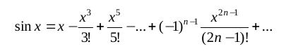

# Task 2.1

```
Eurotrans Group. The shipping company orders you
developing an order management program that should
perform the following actions:

1. Enter the weight of the cargo (tons).
2. Enter the transportation distance (km).
3. Data analysis and the conclusion of the decision to accept the order.
4. Calculation and output of order parameters (calculated in case of
acceptance of the order) - the required number of machines, cost
insurance, the total cost of the transportation order.
5. Information about the version and author of the program.
6. Exit the program.

Reference information. The company has 15 trucks,
each of which can carry no more than 20 tons of cargo. Rate
is $ 2 per kilometer. The company believes
it is not economically feasible to accept freight orders
less than 50 tons of cargo. Maximum transportation distance - 4000
kilometers. The cost of the order usually includes insurance,
5% of the total cost.
```
# Task 2.2

<h3 align="center"></h3>

```
Numerically verify the equality. For
given value x calculate its left side and decomposition
standing on the right side. For which (n) the expression 
differs from sin (x) by less than a given (epsilon)
Test the decomposition for different values of x.
```
