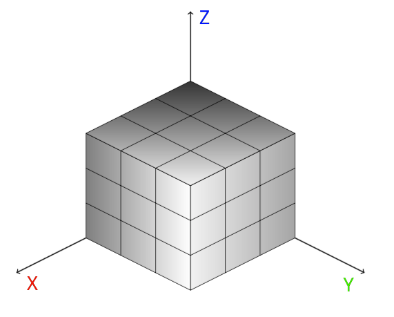

# Task 3.2 (20)

<h3 align="center"></h3>

```
Gaps. The cube consists of n³ transparent and non-transparent
elementary cubes. Is there at least one gap in each of the 
three dimensions? If so, print the coordinates of each gap.

P.S. input.txt contains an example of the format of input parameters
Keep blank line after each data line!
1st line : set cube side length.
In the next lines fill the layers (from the bottom) of the cube,
each layer denotes Z-coordinate.
1/0 - indicators of elementary cubes (1 - transparent, 0 - non-transparent).
Axis direction:↓(Y), →(X)
```
